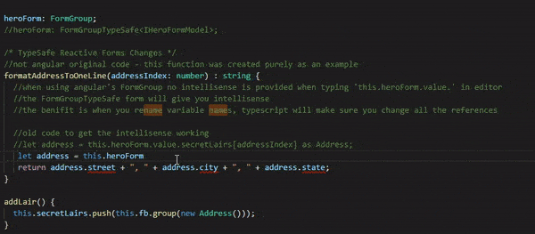
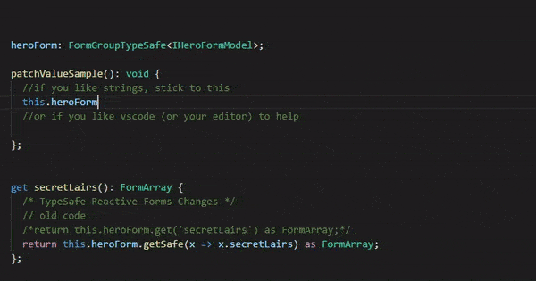

# angular-typesafe-reactive-forms-helper
[](https://github.com/rpbeukes/angular-typesafe-reactive-forms-helper/actions?query=branch%3Amaster+)
   
## Quick Syntax

Instead of:
```typescript
this.form.get('heroName').patchValue('He-Man');
```

angular-typesafe-reactive-forms-helper allows:
```typescript
this.form.getSafe(x => x.heroName).patchValue('He-Man');
```

## Why
- Get intellisense
- No more misspelled property names
- Refactoring Reactive Forms is back to a trivial IDE rename task

## Demo

In order to make this work as closely as possible to the Angular way, an abstract class `FormGroupTypeSafe<T>` was derived from Angular’s `FormGroup` with the intent not to break existing code.


Intellisense on FormGroupTypeSafe<T>.value:



Intellisense on FormGroupTypeSafe<T>.getSafe and then patching the value:



## How to use:

###  1. Define an interface of your form model.
```typescript
//interface used with FormGroupTypeSafe<T>
interface IHeroFormModel {
  name: string;
  secretLairs: Array<Address>;
  power: string;
  sidekick: string
}
```

### 2. Declare your new FormGroupTypeSafe form with the help of TypeScript’s generics.
```typescript
/* TypeSafe Reactive Forms Changes */
//old code
//heroForm: FormGroup;
heroForm: FormGroupTypeSafe<IHeroFormModel>;

```
### 3. Inject FormBuilderTypeSafe
```typescript
constructor(
   /* TypeSafe Reactive Forms Changes */
   //old code - private fb: FormBuilder,
   private fb: FormBuilderTypeSafe,
   private heroService: HeroService) {

   this.createForm();
   this.logNameChange();
 }
```
### 4. Create your form group with Interfaces (contracts).
```typescript
// old code
//    this.heroForm = this.fb.group({
//      name: '',
//      secretLairs: this.fb.array([]),
//      power: '',
//      sidekick: ''
//    });


 this.heroForm = this.fb.group<IHeroFormModel>({
      name: new FormControl(''),
      secretLairs: new FormControl([]),
      power: new FormControl(''),
      sidekick: new FormControl('')
    });

//***** Nested type sample *****
interface IAddressModel {
   suburb: string;
   postcode: string;
}

interface ICustomerModel {
  name: string;
  address: IAddressModel;
}

 this.form = this.fb.group<ICustomerModel>({
        name: new FormControl(null, [Validators.required]),
        address: this.formBuilder.group<IAddressModel>({
            suburb: new FormControl(''),
            postcode: new FormControl('', [Validators.required]),
      })
  });
```
## Peer Dependencies 

`@angular/forms` and all its peer dependencies.

This package has been tested with Angular 6, 7, 8, 9.

(Should work with Angular 4 & 5 too)

I would encourage you to use versions Angular still support, see [Angular's Support policy and schedule](https://angular.io/guide/releases#support-policy-and-schedule).

## Blog

For a more in detail description of the benefits of this package, read my blog - [Angular typesafe reactive forms](https://ruanbeukes.net/angular-typesafe-reactive-forms/).

When reading the blog, be mindful that it was written Oct-2017, before the `angular-typesafe-reactive-forms-helper` package existed. Back then, the idea was to copy the code and adjust as needed. Since then, there were a few requests, thus `angular-typesafe-reactive-forms-helper` was born.

## Contributions

I only added features required by my projects, but I know more could be added with your help.

Create a PR to get the conversation started :smile:

## Lastly

Use it…don’t use it :smile:

---

## Release notes
The model used for all code samples:
```typescript
interface HeroFormModel {
    heroName: string;
    weapons: WeaponModel[];
}
  
interface WeaponModel {
    name: string;
    damagePoints: number;
}
```
### FormGroupTypeSafe\<T> extends Angular's FormGroup class 

#### [V1.7.0](https://github.com/rpbeukes/angular-typesafe-reactive-forms-helper/compare/V1.6.0...V1.7.0) (2020-05-14)
- added `controls`

Angular's `forms.d.ts`:
```typescript
controls: { [key: string]: AbstractControl; };
```

angular-typesafe-reactive-forms-helper:
```typescript 
controls: { [P in keyof T]: AbstractControlTypeSafe<T[P]> };
```

 Code samples:
 ```typescript
 let sut: FormGroupTypeSafe<HeroFormModel> = createGroup();
 // $ExpectType { heroName: AbstractControlTypeSafe<string>; weapons: AbstractControlTypeSafe<WeaponModel[]>; }
  sut.controls;

  // $ExpectType AbstractControlTypeSafe<string>
  sut.controls.heroName;
  // $ExpectType AbstractControlTypeSafe<WeaponModel[]>
  sut.controls.weapons;

  // $ExpectType string
  sut.controls.heroName.value;
  // $ExpectType WeaponModel[]
  sut.controls.weapons.value;
 ```

---
#### [V1.6.0](https://github.com/rpbeukes/angular-typesafe-reactive-forms-helper/compare/V1.5.1...V1.6.0) (2020-04-22)
- added `statusChanges` and `status`
  
Angular's `forms.d.ts`:
```typescript
/**
 * The validation status of the control. There are four possible
 * validation status values:
 *
 * * **VALID**: This control has passed all validation checks.
 * * **INVALID**: This control has failed at least one validation check.
 * * **PENDING**: This control is in the midst of conducting a validation check.
 * * **DISABLED**: This control is exempt from validation checks.
 *
 * These status values are mutually exclusive, so a control cannot be
 * both valid AND invalid or invalid AND disabled.
 */
readonly status: string;
```

angular-typesafe-reactive-forms-helper:
```typescript 
 export type ControlStatus = 'VALID' | 'INVALID' | 'PENDING' | 'DISABLED';

 export interface FormGroupTypeSafe<T> extends FormGroup {
  readonly status: ControlStatus;
  readonly statusChanges: Observable<ControlStatus>;
}
 ```

 Code samples:
 ```typescript
  let sut: FormGroupTypeSafe<HeroFormModel> = createGroup();

  // $ExpectType ControlStatus
  sut.status;

  sut.statusChanges.subscribe(val => {
      // $ExpectType ControlStatus
      val;
  });

  // $ExpectType string | undefined
  sut.getSafe(x => x.heroName)?.status; // unfortunately this is still string ¯\_(ツ)_/¯

  sut.getSafe(x => x.heroName)?.statusChanges.subscribe(val => {
      // $ExpectType ControlStatus
      val;
  });
  
 ```

---
#### [V1.5.1](https://github.com/rpbeukes/angular-typesafe-reactive-forms-helper/compare/V1.5.0...V1.5.1) (2020-04-17)

Had this error in `Angular 9.1.2` when executing `ng serve`.
The app would show a blank page with an error in browser's `devtools` console:
```
main.ts:15 Error: Angular JIT compilation failed: '@angular/compiler' not loaded!
  - JIT compilation is discouraged for production use-cases! Consider AOT mode instead.
  - Did you bootstrap using '@angular/platform-browser-dynamic' or '@angular/platform-server'?
  - Alternatively provide the compiler with 'import "@angular/compiler";' before bootstrapping.
    at getCompilerFacade (core.js:643)
    at Function.get (core.js:16349)
    at getFactoryDef (core.js:2200)
    at providerToFactory (core.js:17183)
    at providerToRecord (core.js:17165)
    at R3Injector.processProvider (core.js:16981)
    at core.js:16960
    at core.js:1400
    at Array.forEach (<anonymous>)
    at deepForEach (core.js:1400)
```

This is fixed.

More info on the error from [StackOverflow](https://stackoverflow.com/questions/60183056/ionic-5-with-angular-9-angular-jit-compilation-failed-angular-compiler-not#answer-60183174).

---
#### [V1.5.0](https://github.com/rpbeukes/angular-typesafe-reactive-forms-helper/compare/V1.4.0...V1.5.0)  (2020-04-15)

Extend `AbstractControlTypeSafe<P>` with:
```typescript
  readonly valueChanges: Observable<T>;
  get(path: Array<string> | string): AbstractControl | null; 
  get(path: number[]): AbstractControlTypeSafe<T extends (infer R)[] ? R : T> | null;
```

- Samples `readonly valueChanges: Observable<T>;`:
```typescript
let sut: FormGroupTypeSafe<HeroFormModel> = createGroup();
sut.valueChanges.subscribe(val => {
    // $ExpectType HeroFormModel
    val;
});

sut.getSafe(x => x.heroName).valueChanges.subscribe(val => {
    // $ExpectType string
    val;
});
```  

- Split Angular's `get` into two functions based on the `path: Array<string | number> | string` parameter.

Angular's `forms.d.ts`:
```typescript
      get(path: Array<string | number> | string): AbstractControl | null;
```

angular-typesafe-reactive-forms-helper:
```typescript 
 get(path: Array<string> | string): AbstractControl | null;
 get(path: number[]): AbstractControlTypeSafe<T extends (infer R)[] ? R : T> | null;
 ```

This allows type safety when working with arrays.

```typescript
sut.getSafe(x => x.weapons).get([0]).valueChanges.subscribe(val => {
    // $ExpectType WeaponModel
    val;
});

// the angular way - .get('person.name')
sut.getSafe(x => x.weapons).get('person.name').valueChanges.subscribe(val => {
    // $ExpectType any
    val;
});

// the angular way - .get(['person', 'name'])
sut.getSafe(x => x.weapons).get(['person', 'name']).valueChanges.subscribe(val => {
    // $ExpectType any
    val;
});
```
---
#### [V1.4.0](https://github.com/rpbeukes/angular-typesafe-reactive-forms-helper/compare/V1.3.0...V1.4.0) (2020-04-14)
- new interface `AbstractControlTypeSafe<P>` which extends from Angular's `AbstractControl` and will, over time, contain the common properties to Angular's `FormGroup`, `FormControl` and `FormArray`.
Currently it only returns `readonly value: T`.

- enhanced `getSafe` to return `AbstractControlTypeSafe<P>`
```typescript
  getSafe<P>(propertyFunction: (typeVal: T) => P): AbstractControlTypeSafe<P> | null;
```
Code example:
```typescript
 // heroName: string
 sut.getSafe(x => x.heroName)?.value; // value's ExpectType => string | undefined
```

- add new type `RecursivePartial<T>`
- enhanced `patchValue` to use `RecursivePartial<T>` so one is not forced by the compiler to complete mandatory properties on a nested types.
```typescript
patchValue(value: RecursivePartial<T>, options?: Object): void;
```
Code Example:
```typescript
let sut: FormGroupTypeSafe<HeroFormModel> = formBuilderTypeSafe.group<HeroFormModel>({...}) // let's pretend a valid FormGroupTypeSafe object was created here  
// Looking at the line below... 
// Before V1.4.0, Typescript would have complained about missing property damagePoints.
// This is not the case anymore as now all nested types will be Partial properties. 
sut.patchValue({ weapons: [{ name: "Head" }]});
```
---
#### [V1.3.0](https://github.com/rpbeukes/angular-typesafe-reactive-forms-helper/compare/V1.2.0...V1.3.0) (2020-04-06)
- patchValue

Angular's `forms.d.ts`:
```typescript
patchValue(value: any, options?: Object): void;
```
angular-typesafe-reactive-forms-helper:
```typescript
patchValue(value: Partial<T>, options?: Object): void;
```

- formBuilderTypeSafe.group\<T> supports `FormArray`

```typescript
 sut = formBuilderTypeSafe.group<HeroFormModel>({
      heroName: new FormControl('He-Man', Validators.required),
      weapons: new FormArray([formBuilderTypeSafe.group<WeaponModel>({
            name: new FormControl('Sword', Validators.required),
            damagePoints: new FormControl(50, Validators.required)
        }),
        formBuilderTypeSafe.group<WeaponModel>({
            name: new FormControl('Shield', Validators.required),
            damagePoints: new FormControl(0, Validators.required)
        }),
      ])
    });
```
---
#### [V1.2.0](https://github.com/rpbeukes/angular-typesafe-reactive-forms-helper/releases/tag/V1.2.0)  (2020-04-02)
- valueChanges, function returns Observable\<T>

Angular's `forms.d.ts`:
```typescript
valueChanges: Observable<any>;
```
angular-typesafe-reactive-forms-helper:
```typescript
valueChanges: Observable<T>;
```
---
#### V1.1.0 (2020-03-31)
- setValue, just a function signature update. 

Angular's `forms.d.ts` function signature:
```typescript
    setValue(value: {
        [key: string]: any;
    }, options?: {
        onlySelf?: boolean;
        emitEvent?: boolean;
    }): void;
```

angular-typesafe-reactive-forms-helper signature:

```typescript
    setValue(value: T, 
            options?: { 
              onlySelf?: boolean; 
              emitEvent?: boolean 
    }): void;
```
---
#### V1.0.0 (2020-03-29)
angular-typesafe-reactive-forms-helper has these extra functions:
- getSafe
- setControlSafe


